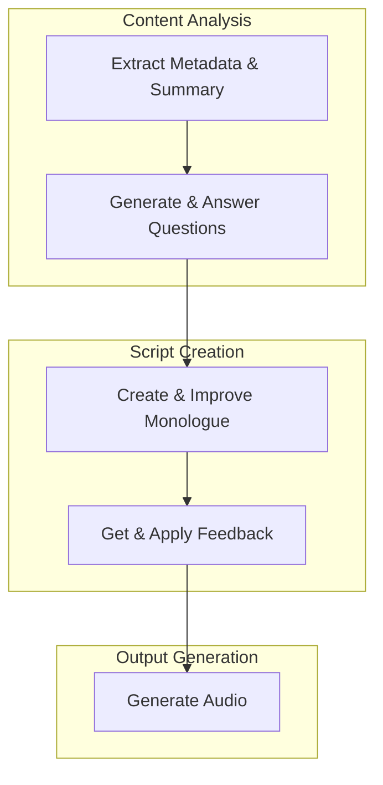

# the-ai-podcast
An open-source AI podcast creator

To use this script, you'll need your own Google Gemini/Anthropic/OpenAI and ElevenLabs API keys. To create a podcast, follow these steps:

```
pip install pydub anthropic google-generativeai openai
export GOOGLE_API_KEY=<your-google-api-key>
export ELEVENLABS_API_KEY=<your-elevenlabs-api-key>
python podcast.py \
    --input the-ai-podcast/episode-01-audio-lm/audio-lm.txt \
    --output-dir the-ai-podcast/episode-01-audio-lm \
    --model-name gemini-1.5-flash-002 \
    --llm-provider google \
    --save-traces \
    --voice Callum
```

You can find an example of a generated podcast at [`the-ai-podcast/episode-01-audio-lm/audio.mp3`](the-ai-podcast/episode-01-audio-lm/audio.mp3).


This diagram illustrates the podcast creation process:


## Limitations

- Currently, only one source document is supported for podcast creation. If you want to create a podcast from multiple sources, combine them into a single document.

## Responsible Use

- Be mindful of the generated content, as you are responsible for what it communicates.
- Inform your audience that the podcast is generated by AI.

## Changelog

### 2024-11-09
- Added support for OpenAI

### 2024-11-07
- Added options to generate only the script or only the audio
- Incorporated three rounds of LLM feedback to improve the script
- Cleaned up and improved prompts

### 2024-11-04
- Added Gemini 1.5 Flash support (faster and cheaper)
- Improved quality through listener feedback
- Used an LLM call to clean up the final script before voice generation
- Unified the LLM interface for Anthropic and Google Gemini
- Separated the host background and show format into dedicated files

### 2024-11-03
- Added support for Google Gemini as an LLM provider
- Added LLM trace saving for debugging and analysis
- Added host personality to make podcasts more engaging and natural
